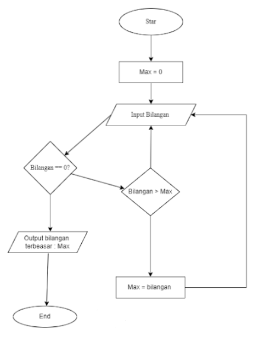

# Program Mencari Bilangan Terbesar 
program sederhana untuk mencari nilai terbesar dari sekumpulan bilangan yang dimasukan oleh pengguna loop 
while True dan break statement.
## Deskripsi Program 
Program ini dibuat menggunakan bahasa Python dengan fitur:

- Menggunakan while True untuk perulangan tak terbatas
- Menggunakan break statement untuk menghentikan program
- Membandingkan setiap input dengan nilai maksimum yang tersimpan
- Menampilkan bilangan terbesar yang ditemukan

## Flowchart Program 


## Kode Program 
```Python 
max = 0
bilangan = int(input("masukan bilangan :"))
While bilangan !=0
  if bilangan > max: 
      max = bilangan
    bilangan = int(input ("masukan bilangan :"))

  print(f"bilangan terbesar {max}")
  ```
# Output Program 
````
masukan bilangan : 70
masukan bilangan : 30
masukan bilangan : 80
masukan bilangan : 10
masukan bilangan : 123
masukan bilangan : 0
bilangan terbesar : 123
````

# Cara Kerja Program 
adanya variable max di isi dengan nilai 0, setelah itu terhadap variable inputab dengan nama bilangan, jika kondisi bilangan tidak 
sama dengan 0 maka cari bilangan lebih dari max di set dengan bilangan tersebut. jika bilangan lebih kecil dari max maka bilangan input
kembali sehingga akan menghasilkan bilangan terbesar dari operasi tersebut.
to
